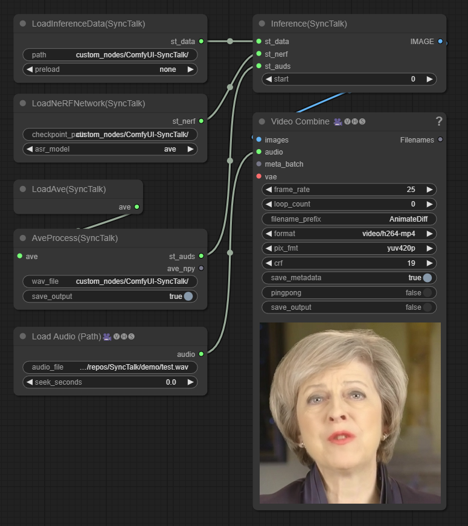

# Introduction
Currently this is only a minimal port of the inference functionalities of the original [SyncTalk](https://github.com/ZiqiaoPeng/SyncTalk), which uses NeRF based technology that creates a talking head with synchronized lip movements etc.

The custom nodes contain only wav process and inference functionalities. If you want to train your model, please see the guides in [SyncTalk](https://github.com/ZiqiaoPeng/SyncTalk).

NOTE: This is a wip repository tested only on Ubuntu22.04 with python3.12.5, pytorch2.4 and cuda12.4.

# Installation
Open "custom_nodes" folder and clone this repo.

At first start, some requirements will be installed, and dependent repos ([pytorch3d](https://github.com/facebookresearch/pytorch3d/tree/main), a forked [SyncTalk](https://github.com/Ryuukeisyou/SyncTalk) for newer pytorch version) will be cloned to "custom_nodes/ComfyUI-SyncTalk/Repos/". 

Specially for pytorch3d and four extensions (freqencoder, gridencoder, raymarching, shencoder) in SyncTalk, since there are usually no built wheel, they will be build on the machine and then install, which might take many minutes.

Build wheels and install them in advance is also a choice.

# Workflow
For quick start, please download training data and trained checkpoints from [SyncTalk](https://github.com/ZiqiaoPeng/SyncTalk) in advance, and put them in correct locations under "custom_nodes/ComfyUI-SyncTalk/repos/SyncTalk/".

The following video contains a workflow to use in ComfyUI. Or you can use workflow.json in demo.

https://github.com/user-attachments/assets/e017206d-1a68-4334-859f-9a74891d7de3

This workflow contains nodes from [ComfyUI-VideoHelperSuite](https://github.com/Kosinkadink/ComfyUI-VideoHelperSuite). You may need to install it in advance.

